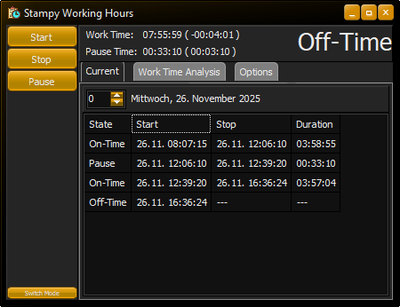
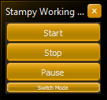
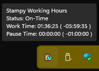
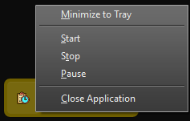
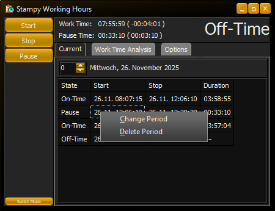
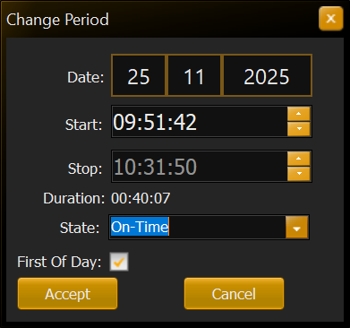
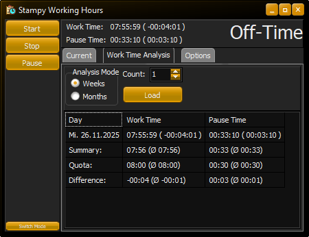
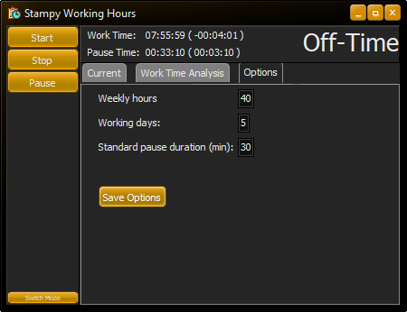

# Stampy

Stampy is a very basic, portable Windows application to track your working hours. 
All your data is stored locally!

## Simple Mode

In Simple Mode only the necessary buttons to change your working state are displayed.

When the window is closed in Simple Mode, the application **won't** stop but it **minimizes** into the system tray. 
Hovering the mouse over the tray icon will display the status, work time and pause time for the current day.

Additionally, right-clicking the Stampy tray icon will open a context menu allowing you to record a start, stop or pause.

## Editing and Deleting Entries
You can edit or delete an entry by right-clicking it in the timetable. 
The displayed day can be changed using the arrow buttons next to the date or by directly entering an offset relative to the current day.

## Work Time Analysis
The `Work Time Analysis` tab allows you to analyze the recorded working time on a weekly or monthly basis.
The number of weeks or months to analyze can be specified using the arrow buttons next to `Count` or by directly editing that number.
The calculations use the configured options on the `Options` tab to determine your working hours, your quota and the difference between those two values (i.e. overtime or missing hours).

